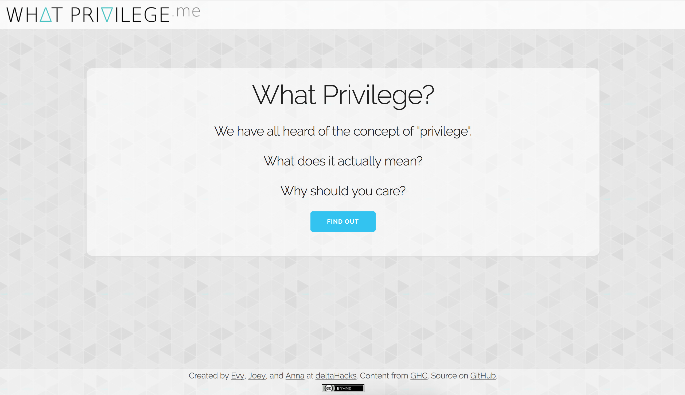

# What Privilege?

**Privilege**: Unearned, unasked-for advantage gained because of the way society views an aspect of your identity.

http://whatprivilege.me is a web app version of a privilege walk, created at [DeltaHacks](http://deltahacks.io/).

"The purpose of this activity is to learn to recognize how power and privilege can affect our lives even when we are not aware it is happening. The purpose is not to blame anyone for having more power or privilege or for receiving more help in achieving goals, but to have an opportunity to identify both obstacles and benefits experienced in our life." ([Source](http://www.albany.edu/ssw/efc/pdf/Module%205_1_Privilege%20Walk%20Activity.pdf))


On April 28, 2017 I dumped the database into [a file](https://github.com/evykassirer/whatprivilege/blob/master/data_backup.json) and shut down the site. You are welcome to fork this repo and put it back online, if you give us acknowledgement. Here are some screenshots of what the site looks like:



------

Definitely let us know if you are interested in contributing!

Coming soon:
- resource links (more about different types of privilege and oppression, how you can help)
- ability to create custom set of questions for a workshop
- tests for our code!
- feedback box for more questions and other suggestions
- moderated discussion page(s)


## Installation instructions (development)

You will need django installed in your system (tested with django 1.10.3 and Python 2.7.13)

rename `django_project/sample_settings.py` to `django_project/settings.py` (and you might want to edit some settings there, the SECRET_KEY at least)

then run these commands:

```bash
python manage.py migrate --run-syncdb
python manage.py loaddata data.json
python manage.py runserver
```
